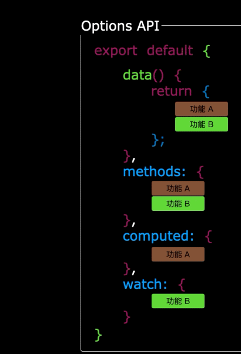
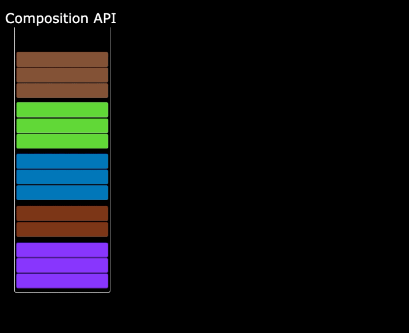
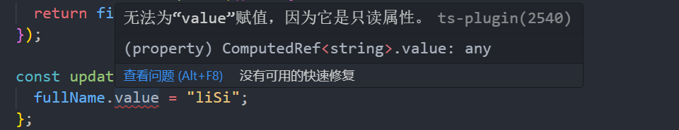
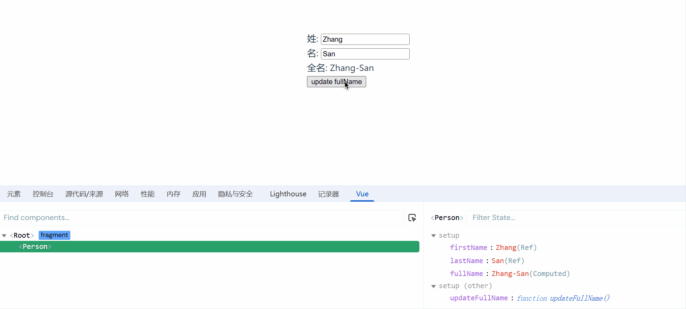
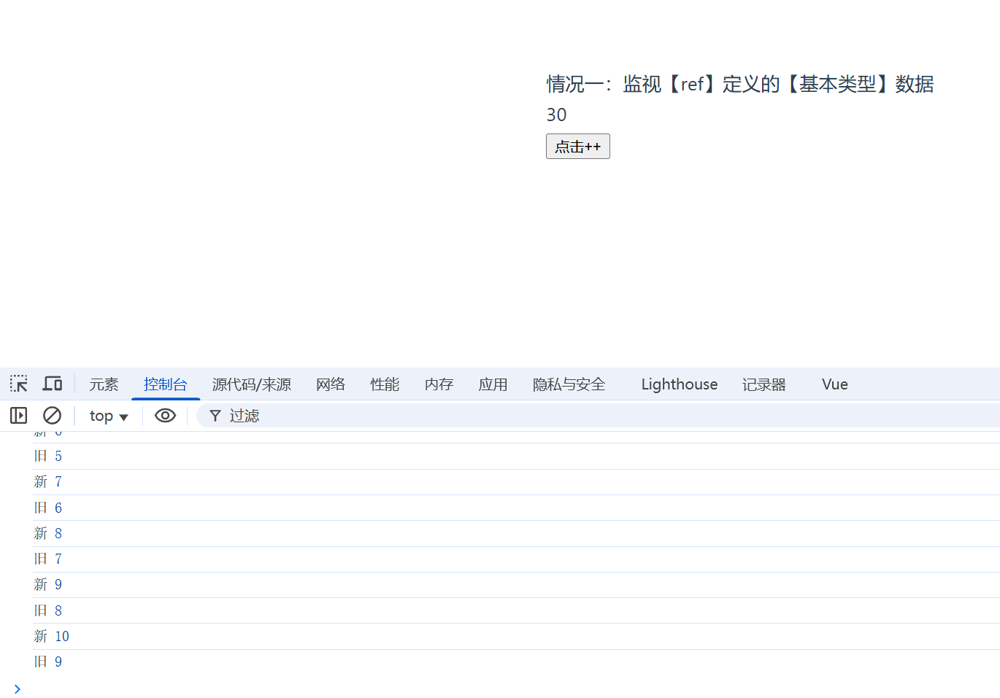

# Vue3快速上手

## Vue3简介
- 2020年9月18日，`Vue.js`发布版`3.0`版本，代号：`One Piece`（n
- 经历了：[4800+次提交](https://github.com/vuejs/core/commits/main)、[40+个RFC](https://github.com/vuejs/rfcs/tree/master/active-rfcs)、[600+次PR](https://github.com/vuejs/vue-next/pulls?q=is%3Apr+is%3Amerged+-author%3Aapp%2Fdependabot-preview+)、[300+贡献者](https://github.com/vuejs/core/graphs/contributors)
- 官方发版地址：[Release v3.0.0 One Piece · vuejs/core](https://github.com/vuejs/core/releases/tag/v3.0.0)
- 截止2023年10月，最新的公开版本为：`3.3.4`

### 性能的提升
- 打包大小减少`41%`。

- 初次渲染快`55%`, 更新渲染快`133%`。

- 内存减少`54%`。

### 新的特性
`Composition API`（组合`API`）：

- `setup`

- `ref`与`reactive`

- `computed`与`watch`

  ......

## 创建Vue3工程
### 基于 vue-cli 创建
点击查看[官方文档](https://cli.vuejs.org/zh/guide/creating-a-project.html#vue-create)

>备注：目前`vue-cli`已处于维护模式，官方推荐基于 `Vite` 创建项目。

```shell
## 查看@vue/cli版本，确保@vue/cli版本在4.5.0以上
vue --version

## 安装或者升级你的@vue/cli 
npm install -g @vue/cli

## 执行创建命令
vue create vue_test

##  随后选择3.x
##  Choose a version of Vue.js that you want to start the project with (Use arrow keys)
##  > 3.x
##    2.x

## 启动
cd vue_test
npm run serve
```

### 基于 vite 创建
`vite` 是新一代前端构建工具，官网地址：[https://vitejs.cn](https://vitejs.cn/)，`vite`的优势如下：

- 轻量快速的热重载（`HMR`），能实现极速的服务启动。
- 对 `TypeScript`、`JSX`、`CSS` 等支持开箱即用。
- 真正的按需编译，不再等待整个应用编译完成。
- `webpack`构建 与 `vite`构建对比图如下：


具体操作如下（点击查看[官方文档](https://cn.vuejs.org/guide/quick-start.html#creating-a-vue-application)）

```
## 1.创建命令
npm create vue@latest

## 2.具体配置
## 配置项目名称
√ Project name: vue3_test
## 是否添加TypeScript支持
√ Add TypeScript?  Yes
## 是否添加JSX支持
√ Add JSX Support?  No
## 是否添加路由环境
√ Add Vue Router for Single Page Application development?  No
## 是否添加pinia环境
√ Add Pinia for state management?  No
## 是否添加单元测试
√ Add Vitest for Unit Testing?  No
## 是否添加端到端测试方案
√ Add an End-to-End Testing Solution? » No
## 是否添加ESLint语法检查
√ Add ESLint for code quality?  Yes
## 是否添加Prettiert代码格式化
√ Add Prettier for code formatting?  No
```
自己动手编写一个App组件

```vue
<template>
  <div class="app">
    <h1>你好啊！</h1>
  </div>
</template>

<script lang="ts">
  export default {
    name:'App' //组件名
  }
</script>

<style>
  .app {
    background-color: #ddd;
    box-shadow: 0 0 10px;
    border-radius: 10px;
    padding: 20px;
  }
</style>
```

总结：

- `Vite` 项目中，`index.html` 是项目的入口文件，在项目最外层。
- 加载`index.html`后，`Vite` 解析 `<script type="module" src="xxx">` 指向的`JavaScript`。
- `Vue3`中是通过 `createApp` 函数创建一个应用实例。


## Vue3核心语法
### OptionsAPI 与 CompositionAPI
- `Vue2`的`API`设计是`Options`（配置）风格的。选项式
- `Vue3`的`API`设计是`Composition`（组合）风格的。组合式

### Options API 的弊端
`Options`类型的 `API`，数据、方法、计算属性等，是分散在：`data`、`methods`、`computed`中的，若想新增或者修改一个需求，就需要分别修改：`data`、`methods`、`computed`，不便于维护和复用。




### Composition API 的优势
可以用函数的方式，更加优雅的组织代码，让相关功能的代码更加有序的组织在一起。




### setup 概述
`setup`是`Vue3`中一个新的配置项，值是一个函数，它是 `Composition API` **“表演的舞台**_**”**_，组件中所用到的：数据、方法、计算属性、监视......等等，均配置在`setup`中。

特点如下：

- `setup`函数返回的对象中的内容，可直接在模板中使用。
- `setup`中访问`this`是`undefined`。
- `setup`函数会在`beforeCreate`之前调用，它是“领先”所有钩子执行的。

### setup 的返回值
- 若返回一个**对象**：则对象中的：属性、方法等，在模板中均可以直接使用**（重点关注）。**
- 若返回一个**函数**：则可以自定义渲染内容，代码如下：

```vue
setup(){
  return ()=> '你好啊！'
}
```

### setup 与 Options API 的关系

- `Vue2` 的配置（`data`、`methos`......）中**可以访问到** `setup`中的属性、方法。
- 但在`setup`中**不能访问到**`Vue2`的配置（`data`、`methos`......）。
- 如果与`Vue2`冲突，则`setup`优先。setup可以与data、methods共存但不推荐

## setup 语法糖

`setup`函数有一个语法糖，这个语法糖，可以让我们把`setup`独立出去，代码如下：

```vue
<template>
  <div class="person">
    <h2>姓名：{{ name }}</h2>
    <h2>年龄：{{ age }}</h2>
    <button @click="changeName">修改名字</button>
    <button @click="changeAge">年龄+1</button>
    <button @click="showTel">点我查看联系方式</button>
  </div>
</template>

<!-- 下面的写法是setup语法糖 -->
<script setup lang="ts" name="Person">
// 数据，原来写在data中（注意：此时的name、age、tel数据都不是响应式数据）
let name = "张三";
let age = 18;
let tel = "13888888888";

// 方法，原来写在methods中
function changeName() {
  name = "zhang-san"; //注意：此时这么修改name页面是不变化的
  console.log(name);
}
function changeAge() {
  age += 1; //注意：此时这么修改age页面是不变化的
  console.log(age);
}
function showTel() {
  alert(tel);
}
</script>

```

#### 指定组件名字
扩展：上述代码，还需要编写一个不写`setup`的`script`标签，去指定组件名字，比较麻烦，我们可以借助`vite`中的插件简化

1. 第一步：`npm i vite-plugin-vue-setup-extend -D`
2. 第二步：`vite.config.ts`
```ts
import { defineConfig } from 'vite'
import VueSetupExtend from 'vite-plugin-vue-setup-extend'

export default defineConfig({
  plugins: [ VueSetupExtend() ]
})
```

在 Vue 3.3+ 中引入了 `defineOptions`，它可以让我们在 `<script setup>` 中直接定义这些组件选项，而不需要切换回传统的 `export default` 语法。

defineOptions 的作用是集中管理组件的元信息和配置选项。以下是一些常见的用途：

- 定义组件名称 （name）：用于调试工具（如 Vue DevTools）或递归组件。
- 控制属性继承 （inheritAttrs）：决定是否将父组件传递的非 prop 属性自动绑定到根元素。
- 自定义选项 ：可以定义任意自定义的组件选项。
- 其他高级配置 ：如 customElement 配置等。

```vue
<template>
  <div>
    <h1>这是一个组件</h1>
    <p>{{ message }}</p>
  </div>
</template>

<script setup>
import { ref } from 'vue'

// 使用 defineOptions 定义组件选项
defineOptions({
  name: 'MyComponent', // 组件名称
  inheritAttrs: false, // 禁用属性继承
  customOption: 'This is a custom option' // 自定义选项
})

const message = ref('Hello, Vue 3!')
</script>
```
---

### ref 创建：基本类型的响应式数据
- **作用**：定义响应式变量。
- **语法：**`let xxx = ref(初始值)`。
- **返回值**：一个`RefImpl`的实例对象，简称`ref对象`或`ref`，`ref`对象的`value`**属性是响应式的**。
- **注意点：**
  - `JS`中操作数据需要：`xxx.value`，但模板中不需要`.value`，直接使用即可。
  - 对于`let name = ref('张三')`来说，`name`不是响应式的，`name.value`是响应式的。

```vue
<template>
  <div class="person">
    <h2>姓名：{{name}}</h2>
    <h2>年龄：{{age}}</h2>
    <button @click="changeName">修改名字</button>
    <button @click="changeAge">年龄+1</button>
    <button @click="showTel">点我查看联系方式</button>
  </div>
</template>

<script setup lang="ts" name="Person">
  import {ref} from 'vue'
  // name和age是一个RefImpl的实例对象，简称ref对象，它们的value属性是响应式的。
  let name = ref('张三')
  let age = ref(18)
  // tel就是一个普通的字符串，不是响应式的
  let tel = '13888888888'

  function changeName(){
    // JS中操作ref对象时候需要.value
    name.value = '李四'
    console.log(name.value)

    // 注意：name不是响应式的，name.value是响应式的，所以如下代码并不会引起页面的更新。
    // name = ref('zhang-san')
  }
  function changeAge(){
    // JS中操作ref对象时候需要.value
    age.value += 1 
    console.log(age.value)
  }
  function showTel(){
    alert(tel)
  }
</script>
```

### reactive 创建：对象类型的响应式数据

- **作用：**定义一个**响应式对象**（基本类型不要用它，要用`ref`，否则报错）
- **语法：**`let 响应式对象= reactive(源对象)`。
- **返回值**：一个`Proxy`的实例对象，简称：响应式对象。
- **注意点：**`reactive`定义的响应式数据是“深层次”的。

```vue
<template>
  <div class="person">
    <h2>汽车信息：一台{{ car.brand }}汽车，价值{{ car.price }}万</h2>
    <h2>游戏列表：</h2>
    <ul>
      <li v-for="g in games" :key="g.id">{{ g.name }}</li>
    </ul>
    <h2>测试：{{obj.a.b.c.d}}</h2>
    <button @click="changeCarPrice">修改汽车价格</button>
    <button @click="changeFirstGame">修改第一游戏</button>
    <button @click="test">测试</button>
  </div>
</template>

<script lang="ts" setup name="Person">
import { reactive } from 'vue'

// 数据
let car = reactive({ brand: '奔驰', price: 100 })
let games = reactive([
  { id: 'ahsgdyfa01', name: '英雄联盟' },
  { id: 'ahsgdyfa02', name: '王者荣耀' },
  { id: 'ahsgdyfa03', name: '原神' }
])
let obj = reactive({
  a:{
    b:{
      c:{
        d:666
      }
    }
  }
})

function changeCarPrice() {
  car.price += 10
}
function changeFirstGame() {
  games[0].name = '流星蝴蝶剑'
}
function test(){
  obj.a.b.c.d = 999
}
</script>
```

### ref 创建：对象类型的响应式数据
- 其实`ref`接收的数据可以是：**基本类型**、**对象类型**。
- 若`ref`接收的是对象类型，内部其实也是调用了`reactive`函数。

```vue
<template>
  <div class="person">
    <h2>汽车信息：一台{{ car.brand }}汽车，价值{{ car.price }}万</h2>
    <h2>游戏列表：</h2>
    <ul>
      <li v-for="g in games" :key="g.id">{{ g.name }}</li>
    </ul>
    <h2>测试：{{obj.a.b.c.d}}</h2>
    <button @click="changeCarPrice">修改汽车价格</button>
    <button @click="changeFirstGame">修改第一游戏</button>
    <button @click="test">测试</button>
  </div>
</template>

<script lang="ts" setup name="Person">
import { ref } from 'vue'

// 数据
let car = ref({ brand: '奔驰', price: 100 })
let games = ref([
  { id: 'ahsgdyfa01', name: '英雄联盟' },
  { id: 'ahsgdyfa02', name: '王者荣耀' },
  { id: 'ahsgdyfa03', name: '原神' }
])
let obj = ref({
  a:{
    b:{
      c:{
        d:666
      }
    }
  }
})

console.log(car)

function changeCarPrice() {
  car.value.price += 10
}
function changeFirstGame() {
  games.value[0].name = '流星蝴蝶剑'
}
function test(){
  obj.value.a.b.c.d = 999
}
</script>
```

## ref 对比 reactive
宏观角度看：

> 1. `ref`用来定义：**基本类型数据**、**对象类型数据**；
>
> 2. `reactive`用来定义：**对象类型数据**。

区别：
1.  `ref`创建的变量必须使用`.value`（可以使用`volar`插件自动添加`.value`）。
2.  `reactive`重新分配一个新对象，会**失去**响应式（可以使用`Object.assign`去整体替换）。

在 Vue 3 的响应式系统中，如果你直接对一个由 reactive 创建的响应式对象重新赋值为一个新的对象（例如 state = newState），那么这个新的对象将失去响应式特性 。这是因为 Vue 的响应式系统是基于代理（Proxy）实现的，直接替换整个对象会导致 Vue 无法继续追踪新对象的变化。

```js
import { reactive } from 'vue'

const state = reactive({ count: 0 })
state.count++ // 修改 count 的值会触发视图更新
// 当你直接重新分配一个新对象时，比如：
state = { count: 10 }
```
这实际上会将 state 指向一个全新的普通对象 { count: 10 }，而这个新对象并没有被 reactive 包裹，因此它不再是响应式的。Vue 的响应式系统只能追踪最初通过 reactive 创建的对象及其属性变化。

为了避免失去响应式，可以使用 `Object.assign` 或解构赋值的方式，将新对象的属性合并到现有的响应式对象中。这样可以确保 Vue 的响应式系统仍然能够追踪这些属性的变化。
```js
import { reactive } from 'vue'

const state = reactive({ count: 0 })

// 使用 Object.assign 合并新对象
Object.assign(state, { count: 10, name: 'Vue' })

console.log(state) // 输出：{ count: 10, name: 'Vue' }
```
你也可以通过解构赋值的方式逐个更新属性：
```js
const newState = { count: 10, name: 'Vue' }

state.count = newState.count
state.name = newState.name
```


- 使用原则：

> 1. 若需要一个基本类型的响应式数据，必须使用`ref`。
> 2. 若需要一个响应式对象，层级不深，`ref`、`reactive`都可以。
> 3. 若需要一个响应式对象，且层级较深，推荐使用`reactive`。

## toRefs 与 toRef

- 作用：将一个响应式对象中的每一个属性，转换为`ref`对象。
- 备注：`toRefs`与`toRef`功能一致，但`toRefs`可以批量转换。

```vue
<template>
  <div class="person">
    <h2>姓名：{{ person.name }}</h2>
    <h2>年龄：{{ person.age }}</h2>
    <h2>性别：{{ person.gender }}</h2>
    <button @click="changeName">修改名字</button>
    <button @click="changeAge">年龄+1</button>
    <button @click="showTel">点我查看联系方式</button>
  </div>
</template>

<script setup lang="ts" name="Person">
import { reactive, toRefs, toRef } from "vue";

let person = reactive({
  name: "张三",
  age: 18,
  gender: "男",
  tel: "18966666666",
});

// 通过toRefs将person对象中的n个属性批量取出，且依然保持响应式的能力
let { age, name } = toRefs(person);

// 通过toRef将person对象中的gender属性取出，且依然保持响应式的能力
let gender = toRef(person, "gender");

const changeName = () => {
  person.name += "~";
};

const changeAge = () => {
  person.age += 1;
};

const showTel = () => {
  alert(person.tel);
};
</script>

```


## computed
作用：根据已有数据计算出新数据（和`Vue2`中的`computed`作用一致）。

```vue
<template>
  <div class="person">
    <h3>姓: <input type="text" v-model="firstName" /></h3>
    <h3>名: <input type="text" v-model="lastName" /></h3>
    <h3>全名: {{ fullName }}</h3>
  </div>
</template>

<script setup lang="ts" name="Person">
import { ref, computed } from "vue";

let firstName = ref("Zhang");
let lastName = ref("San");

let fullName = computed(() => {
  return firstName.value + "-" + lastName.value;
});
</script>

```


若想直接修改fullName，是不可以的，这么定义的fullName是一个计算属性，且是只读的
```vue
<template>
  <div class="person">
    <h3>姓: <input type="text" v-model="firstName" /></h3>
    <h3>名: <input type="text" v-model="lastName" /></h3>
    <h3>全名: {{ fullName }}</h3>
    <div><button @click="updateFullName">update fullName</button></div>
  </div>
</template>

<script setup lang="ts" name="Person">
import { ref, computed } from "vue";

let firstName = ref("Zhang");
let lastName = ref("San");

let fullName = computed(() => {
  return firstName.value + "-" + lastName.value;
});

const updateFullName = () => {
  fullName.value = "liSi";
};
</script>

```



这么定义的fullName是一个计算属性，可读可写

```vue
<template>
  <div class="person">
    <h3>姓: <input type="text" v-model="firstName" /></h3>
    <h3>名: <input type="text" v-model="lastName" /></h3>
    <h3>全名: {{ fullName }}</h3>
    <div><button @click="updateFullName">update fullName</button></div>
  </div>
</template>

<script setup lang="ts" name="Person">
import { ref, computed } from "vue";

let firstName = ref("Zhang");
let lastName = ref("San");

let fullName = computed({
  get() {
    return firstName.value + "-" + lastName.value;
  },
  set(val) {
    // val是updateFullName方法修改后返回的新值
    // console.log(val);
    const [str1, str2] = val.split("-");
    firstName.value = str1;
    lastName.value = str2;
  },
});

const updateFullName = () => {
  fullName.value = "Li-Si";
};
</script>

```




## watch

- 作用：监视数据的变化（和`Vue2`中的`watch`作用一致）
- 特点：`Vue3`中的`watch`只能监视以下**四种数据**：

> 1. `ref`定义的数据。
> 2. `reactive`定义的数据。
> 3. 函数返回一个值（`getter`函数）。
> 4. 一个包含上述内容的数组。

我们在`Vue3`中使用`watch`的时候，通常会遇到以下几种情况：

### 情况一
监视`ref`定义的【基本类型】数据：直接写数据名即可，监视的是其`value`值的改变。


```vue
<template>
  <div class="person">
    <h3>情况一：监视【ref】定义的【基本类型】数据</h3>
    <h3>{{ sum }}</h3>
    <h3><button @click="add">点击++</button></h3>
  </div>
</template>

<script setup lang="ts" name="Person">
import { ref, watch } from "vue";

let sum = ref(0);

const add = () => {
  sum.value++;
};

let stopWatch = watch(sum, (newValue, oldValue) => {
  console.log("新", newValue);
  console.log("旧", oldValue);
  if (sum.value == 10) {
    stopWatch(); // 停止监听
  }
});
</script>

```


### 情况二
监视`ref`定义的【对象类型】数据：直接写数据名，监视的是对象的【地址值】，若想监视对象内部的数据，要手动开启深度监视。

:::tip
注意：

* 若修改的是`ref`定义的对象中的属性，`newValue` 和 `oldValue` 都是新值，因为它们是同一个对象。

* 若修改整个`ref`定义的对象，`newValue` 是新值， `oldValue` 是旧值，因为不是同一个对象了。
:::


```vue
<template>
  <div class="person">
    <h3>情况二：监视【ref】定义的【对象类型】数据</h3>
    <h3>{{ person.name }}</h3>
    <h3>{{ person.age }}</h3>
    <h3><button @click="changeName">update Name</button></h3>
    <h3><button @click="changeAge">update Age</button></h3>
    <h3><button @click="changePerson">修改整个</button></h3>
  </div>
</template>

<script setup lang="ts" name="Person">
import { ref, watch } from "vue";

let person = ref({
  name: "张三",
  age: 30,
});

const changeName = () => {
  person.value.name += "~";
};
const changeAge = () => {
  person.value.age++;
};

const changePerson = () => {
  person.value = { name: "Jack", age: 60 };
};

// 监视【ref】定义的【对象类型】数据，监视的是对象的地址值，若想监视对象内部属性的变化，需要手动开启深度监视
// watch的第一个参数是:被监视的数据
// watch的第二个参数是:监视的回调
// watch的第三个参数是:配置对象(deep、immediate等等)
watch(
  person,
  (newValue, oldValue) => {
    console.log("新", newValue);
    console.log("旧", oldValue);
  },
  { deep: true, immediate: true }
);
</script>


```
 
### 情况三

监视`reactive`定义的【对象类型】数据，且默认开启了深度监视。

> 深度监视不可关闭，且新值旧值都是新值，因为地址没变

```vue
<template>
  <div class="person">
    <h3>情况三：监视【reactive】定义的【对象类型】数据</h3>
    <h3>{{ person.name }}</h3>
    <h3>{{ person.age }}</h3>
    <h3><button @click="changeName">update Name</button></h3>
    <h3><button @click="changeAge">update Age</button></h3>
    <h3><button @click="changePerson">修改整个</button></h3>
  </div>
</template>

<script setup lang="ts" name="Person">
import { reactive, watch } from "vue";

let person = reactive({
  name: "张三",
  age: 30,
});

const changeName = () => {
  person.name += "~";
};
const changeAge = () => {
  person.age++;
};

const changePerson = () => {
  person = Object.assign(person, { name: "Jack", age: 60 });
};

watch(person, (newValue, oldValue) => {
  console.log("新", newValue);
  console.log("旧", oldValue);
});
</script>

```

### 情况四

监视`ref`或`reactive`定义的【对象类型】数据中的**某个属性**，注意点如下：

1. 若该属性值**不是**【对象类型】，需要写成函数形式。
2. 若该属性值是**依然**是【对象类型】，可直接编，也可写成函数，建议写成函数。

结论：监视的要是对象里的属性，那么最好写函数式，注意点：若是对象监视的是地址值，需要关注对象内部，需要手动开启深度监视。

