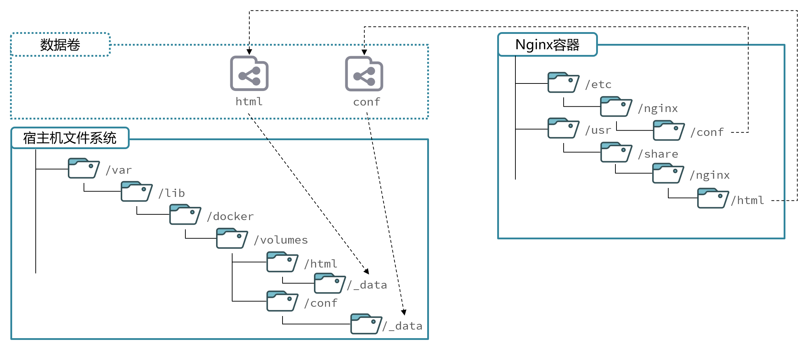

# Docker

## 安装docker

1. 卸载旧版

```shell
yum remove docker \
    docker-client \
    docker-client-latest \
    docker-common \
    docker-latest \
    docker-latest-logrotate \
    docker-logrotate \
    docker-engine \
    docker-selinux 
```

2. 配置Docker的yum库

首先要安装一个yum工具
```Bash
sudo yum install -y yum-utils device-mapper-persistent-data lvm2

```

安装成功后，执行命令，配置Docker的yum源

```Bash
sudo yum-config-manager --add-repo https://mirrors.aliyun.com/docker-ce/linux/centos/docker-ce.repo

sudo sed -i 's+download.docker.com+mirrors.aliyun.com/docker-ce+' /etc/yum.repos.d/docker-ce.repo
```

更新yum，建立缓存

```Bash
sudo yum makecache fast
```

3. 安装docker
```Bash
yum install -y docker-ce docker-ce-cli containerd.io docker-buildx-plugin docker-compose-plugin
```

4. 启动和校验
```Bash
# 启动Docker
systemctl start docker

# 停止Docker
systemctl stop docker

# 重启
systemctl restart docker

# 设置开机自启
systemctl enable docker

# 执行docker ps命令，如果不报错，说明安装启动成功
docker ps
```

5. 配置镜像加速
[Docker/DockerHub 国内镜像源/加速列表](https://xuanyuan.me/blog/archives/1154)

镜像地址可能会变更，如果失效可以百度找最新的docker镜像。
配置镜像步骤如下：

```Bash
# 创建目录
mkdir -p /etc/docker

# 复制内容
tee /etc/docker/daemon.json <<-'EOF'
{
    "registry-mirrors": [
        "http://hub-mirror.c.163.com",
        "https://mirrors.tuna.tsinghua.edu.cn",
        "http://mirrors.sohu.com",
        "https://ustc-edu-cn.mirror.aliyuncs.com",
        "https://ccr.ccs.tencentyun.com",
        "https://docker.m.daocloud.io",
        "https://docker.awsl9527.cn"
    ]
}
EOF

# 重新加载配置
systemctl daemon-reload

# 重启Docker
systemctl restart docker
```


## 镜像和容器

当我们利用Docker安装应用时，Docker:会自动搜索并下载应用镜像(image)。镜像不仅包含应用本身，还包含应用
运行所需要的环境、配置、系统函数库。Docker会在运行镜像时创建一个隔离环境，称为容器(container)。

**镜像仓库**: 存储和管理镜像的平台，Docker官方维护了一个公共仓库:[DockerHub](https://hub.docker.com/)


**总结**

>Docker是做什么的?
>
>Docker可以帮助我们下载应用镜像，创建并运行镜像的容器，从而快速部署应用

>什么是镜像?
>
>将应用所需的函数库、依赖、配置等与应用一起打包得到的就是镜像

>什么是容器?
>
>为每个镜像的应用进程创建的隔离运行环境就是容器

>什么是镜像仓库?
>
>存储和管理镜像的服务就是镜像仓库 DockerHub是目前最大的镜像仓库，其中包含各种常见的应用镜像


## 命令解读

```Bash
docker run -d \
  --name mysql \
  -p 3306:3306 \
  -e TZ=Asia/Shanghai \
  -e MYSQL_ROOT_PASSWORD=123 \
  mysql
  ```

  就是因为Docker会自动搜索并下载MySQL。注意：这里下载的不是安装包，而是镜像。镜像中不仅包含了MySQL本身，还包含了其运行所需要的环境、配置、系统级函数库。因此它在运行时就有自己独立的环境，就可以跨系统运行，也不需要手动再次配置环境了。这套独立运行的隔离环境我们称为容器。

说明：
- 镜像：英文是image
- 容器：英文是container

解读：
>- docker run -d ：创建并运行一个容器，-d则是让容器以后台进程运行
>- --name mysql  : 给容器起个名字叫mysql，你可以叫别的
>- -p 3306:3306 : 设置端口映射。
>  - 容器是隔离环境，外界不可访问。但是可以将宿主机端口映射容器内到端口，当访问宿主机指定端口时，就是在访问容器内的端口了。
>  - 容器内端口往往是由容器内的进程决定，例如MySQL进程默认端口是3306，因此容器内端口一定是3306；而宿主机端口则可以任意指定，一般与容器内保持一致。
>  - 格式： -p 宿主机端口:容器内端口，示例中就是将宿主机的3306映射到容器内的3306端口
>- -e TZ=Asia/Shanghai : 配置容器内进程运行时的一些参数
>  - 格式：-e KEY=VALUE，KEY和VALUE都由容器内进程决定
>  - 案例中，TZ=Asia/Shanghai是设置时区；MYSQL_ROOT_PASSWORD=123是设置MySQL默认密码
>- mysql : 设置镜像名称，Docker会根据这个名字搜索并下载镜像
>  - 格式：REPOSITORY:TAG，例如mysql:8.0，其中REPOSITORY可以理解为镜像名，TAG是版本号
>  - 在未指定TAG的情况下，默认是最新版本，也就是mysql:latest


镜像的名称不是随意的，而是要到DockerRegistry中寻找，镜像运行时的配置也不是随意的，要参考镜像的帮助文档，这些在DockerHub网站或者软件的官方网站中都能找到。


## 常见命令

|命令|说明|
|----|----|
|docker pull|拉取镜像
|docker push|推送镜像到DockerRegistry
|docker images|查看本地镜像
|docker rmi|删除本地镜像
|docker run|创建并运行容器（不能重复创建）
|docker stop|停止指定容器
|docker start|启动指定容器
|docker restart|重新启动容器
|docker rm|删除指定容器
|docker ps|查看运行的容器
|docker ps -a|查看所有容器
|docker logs|查看容器运行日志
|docker exec|进入容器
|docker save|保存镜像到本地压缩文件
|docker load|加载本地压缩文件到镜像
|docker inspect|查看容器详细信息


Docker最常见的命令就是操作镜像、容器的命令，详见官方文档： https://docs.docker.com/


**如何保存下载好的镜像，并打包？**

```Bash
[root@localhost ~]# docker save --help

Usage:  docker save [OPTIONS] IMAGE [IMAGE...]

Save one or more images to a tar archive (streamed to STDOUT by default)

Aliases:
  docker image save, docker save

Options:
  -o, --output string   Write to a file, instead of STDOUT


[root@localhost ~]# docker save -o nginx.tar nginx:latest


[root@localhost ~]# ll
总用量 192044
-rw-------. 1 root root      1241 6月  22 2024 anaconda-ks.cfg
-rw-------. 1 root root 196647424 4月  22 22:32 nginx.tar
 
```


**如何加载回来呢？**

docker load -i nginx.tar

```Bash
[root@localhost ~]# docker load --help

Usage:  docker load [OPTIONS]

Load an image from a tar archive or STDIN

Aliases:
  docker image load, docker load

Options:
  -i, --input string   Read from tar archive file, instead of STDIN
  -q, --quiet          Suppress the load output
[root@localhost ~]# docker load -i nginx.tar
ea680fbff095: Loading layer [==================================================>]   77.9MB/77.9MB
bd903131a05e: Loading layer [==================================================>]  118.7MB/118.7MB
9aad78ecf380: Loading layer [==================================================>]  3.584kB/3.584kB
9e3c6e8c1e25: Loading layer [==================================================>]  4.608kB/4.608kB
8d83f6b79143: Loading layer [==================================================>]   2.56kB/2.56kB
ccc5aac17fc4: Loading layer [==================================================>]   5.12kB/5.12kB
d1e3e4dd1aaa: Loading layer [==================================================>]  7.168kB/7.168kB
Loaded image: nginx:latest
[root@localhost ~]# docker images
REPOSITORY            TAG       IMAGE ID       CREATED        SIZE
nginx                 latest    4e1b6bae1e48   6 days ago     192MB
uums-web              1         d1c9ee2b1a26   8 months ago   946MB
zzy                   1.0.0     5d520aecab93   8 months ago   877MB
tomcat                8         2d2bccf89f53   3 years ago    678MB
redis                 5.0       c5da061a611a   3 years ago    110MB
mysql                 5.6       dd3b2a5dcb48   3 years ago    303MB
centos                7         eeb6ee3f44bd   3 years ago    204MB
mysql                 8.0.25    5c62e459e087   3 years ago    556MB
eclipse/centos_jdk8   latest    5bd02d36ed35   6 years ago    877MB
[root@localhost ~]# 
```

**nginx常规操作**

```Bash
docker pull nginx

docker images

docker run -d --name nginx -p 80:80 nginx

#查看运行中容器
docker ps
# 也可以加格式化方式访问，格式会更加清爽
docker ps --format "table {{.ID}}\t{{.Image}}\t{{.Ports}}\t{{.Status}}\t{{.Names}}"

#停止容器
docker stop nginx

#再次启动nginx容器
docker start nginx

#查看容器详细信息
docker inspect nginx

# 进入容器,查看容器内目录
docker exec -it nginx bash
# 或者，可以进入MySQL
docker exec -it mysql mysql -uroot -p

#删除容器
docker rm nginx
# 发现无法删除，因为容器运行中，强制删除容器
docker rm -f nginx

#查看日志
docker logs -f nginx

#动态查看日志
docker logs -f bef8969d1e0c


```
补充：

默认情况下，每次重启虚拟机我们都需要手动启动Docker和Docker中的容器。通过命令可以实现开机自启：

```Bash
# Docker开机自启
systemctl enable docker

# Docker容器开机自启
docker update --restart=always [容器名/容器id]
```

## 命令别名

```Bash
# 修改/root/.bashrc文件
vi /root/.bashrc
内容如下：
# .bashrc

# User specific aliases and functions

alias rm='rm -i'
alias cp='cp -i'
alias mv='mv -i'
alias dps='docker ps --format "table {{.ID}}\t{{.Image}}\t{{.Ports}}\t{{.Status}}\t{{.Names}}"'
alias dis='docker images'

# Source global definitions
if [ -f /etc/bashrc ]; then
        . /etc/bashrc
fi
```

然后，执行命令使别名生效
```Bash
source /root/.bashrc
```

## 数据卷

容器是隔离环境，容器内程序的文件、配置、运行时产生的容器都在容器内部，我们要读写容器内的文件非常不方便。大家思考几个问题：
- 如果要升级MySQL版本，需要销毁旧容器，那么数据岂不是跟着被销毁了？
- MySQL、Nginx容器运行后，如果我要修改其中的某些配置该怎么办？
- 我想要让Nginx代理我的静态资源怎么办？

因此，容器提供程序的运行环境，但是程序运行产生的数据、程序运行依赖的配置都应该与容器解耦。

**数据卷（volume）**是一个虚拟目录，是**容器内目录**与**宿主机目录**之间映射的桥梁。

以Nginx为例，我们知道Nginx中有两个关键的目录：
- html：放置一些静态资源
- conf：放置配置文件
如果我们要让Nginx代理我们的静态资源，最好是放到html目录；如果我们要修改Nginx的配置，最好是找到conf下的nginx.conf文件。
但遗憾的是，容器运行的Nginx所有的文件都在容器内部。所以我们必须利用数据卷将两个目录与宿主机目录关联，方便我们操作。如图：



在上图中：
- 我们创建了两个数据卷：`conf`、`html`
- Nginx容器内部的conf目录和html目录分别与两个数据卷关联。
- 而数据卷conf和html分别指向了宿主机的`/var/lib/docker/volumes/conf/_data`目录和`/var/lib/docker/volumes/html/_data`目录

这样以来，容器内的conf和html目录就 与宿主机的conf和html目录关联起来，我们称为**挂载**。此时，我们操作宿主机的`/var/lib/docker/volumes/html/_data`就是在操作容器内的`/usr/share/nginx/html/_data`目录。只要我们将静态资源放入宿主机对应目录，就可以被Nginx代理了。

:::tip
`/var/lib/docker/volumes`这个目录就是默认的存放所有容器数据卷的目录，其下再根据数据卷名称创建新目录，格式为`/数据卷名/_data`。
:::

### 数据卷命令

|命令|说明|
|----|----|
|docker volume create|创建数据卷
|docker volume ls|查看所有数据卷
|docker volume rm|删除指定数据卷
|docker volume inspect|查看某个数据卷的详情
|docker volume prune|清除数据卷

注意：容器与数据卷的挂载要在创建容器时配置，对于创建好的容器，是不能设置数据卷的。而且**创建容器的过程中，数据卷会自动创建**。

```Bash
docker run -d --name nginx -p 80:80 -v html:/usr/share/nginx/html nginx


docker volume ls


[root@localhost ~]# docker volume ls
DRIVER    VOLUME NAME
local     html
[root@localhost ~]# docker volume inspect html
[
    {
        "CreatedAt": "2025-04-23T21:37:48+08:00",
        "Driver": "local",
        "Labels": null,
        "Mountpoint": "/var/lib/docker/volumes/html/_data",
        "Name": "html",
        "Options": null,
        "Scope": "local"
    }
]

[root@localhost ~]# cd /var/lib/docker/volumes/html/_data
[root@localhost _data]# ls
50x.html  index.html

#进入容器内部，查看/usr/share/nginx/html目录内的文件是否变化
docker exec -it nginx bash


```


### 总结

**什么是数据卷?**
- 数据卷是一个虚拟目录，它将宿主机目录映射到容器内目录，方便我们操作容器内文件，或者方便迁移容器产生的数据

**如何挂载数据卷?**
- 在创建容器时，利用-v数据卷名:容器内目录完成挂载

- 容器创建时，如果发现挂载的数据卷不存在时，会自动创建

**数据卷的常见命令有哪些?**

- docker volume ls:查看数据卷
- docker volumerm:删除数据卷
- docker volumeinspect:查看数据卷详情
- docker volume prune:删除未使用的数据卷


### 挂载本地目录

**mysql挂载**

数据卷的目录结构较深，如果我们去操作数据卷目录会不太方便。在很多情况下，我们会直接将容器目录与宿主机指定目录挂载。挂载语法与数据卷类似：

```Bash
# 挂载本地目录
-v 本地目录:容器内目录
# 挂载本地文件
-v 本地文件:容器内文件
```

注意：本地目录或文件必须以 / 或 ./开头，如果直接以名字开头，会被识别为数据卷名而非本地目录名。


例如
```
-v mysql:/var/lib/mysql # 会被识别为一个数据卷叫mysql，运行时会自动创建这个数据卷
-v ./mysql:/var/lib/mysql # 会被识别为当前目录下的mysql目录，运行时如果不存在会创建目录
```

mysql挂载位置

- 挂载`/root/mysql/data`到容器内的`/var/lib/mysql`目录
- 挂载`/root/mysql/init`到容器内的`/docker-entrypoint-initdb.d`目录（初始化的SQL脚本目录）
- 挂载`/root/mysql/conf`到容器内的`/etc/mysql/conf.d`目录（这个是MySQL配置文件目录）

init放`xxx.sql`，初始化时只会执行一次

conf放`xxx.cnf`文件

**本地目录挂载：**

```Bash
# 1.删除原来的MySQL容器
docker rm -f mysql

# 2.进入root目录
cd ~

# 3.创建并运行新mysql容器，挂载本地目录
docker run -d \
  --name mysql \
  -p 3306:3306 \
  -e TZ=Asia/Shanghai \
  -e MYSQL_ROOT_PASSWORD=123 \
  -v ./mysql/data:/var/lib/mysql \
  -v ./mysql/conf:/etc/mysql/conf.d \
  -v ./mysql/init:/docker-entrypoint-initdb.d \
  mysql

# 5.1.进入MySQL
docker exec -it mysql mysql -uroot -p123
# 5.2.查看编码表
show variables like "%char%";
```