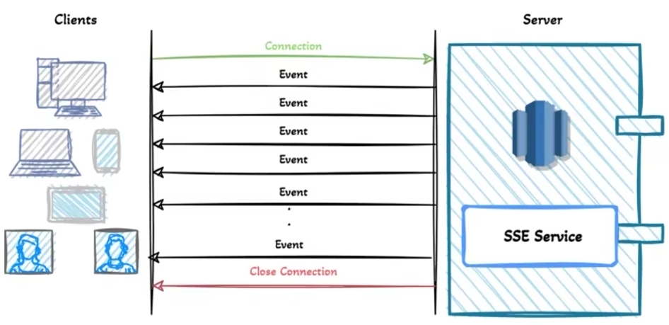
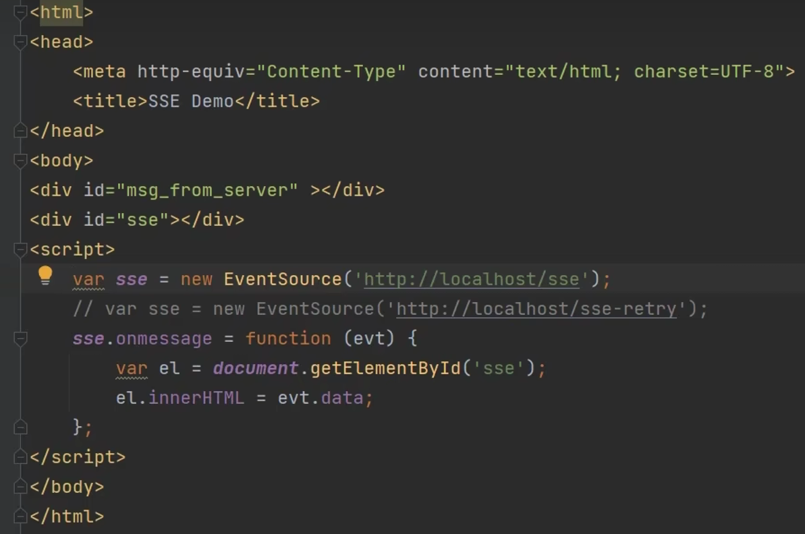

# SSE(Server-Sent Events)

## 什么是 SSE

    服务器发送事件(Server-Sent Events，简称SSE)
    SSE，就是浏览器向服务器发送一个HTTP请求，然后服务器不断单向地向浏览器推送“信息”(message)。
    这种信息在格式上很简单，就是“信息”加上前缀“data:”，然后以“\n\n”结尾。

## SSE 应用场景

    服务器向浏览器“发送”数据，比如，每当收到新的电子邮件，服务器就向浏览器发送一个“通知”



## SSE 与 Websocket

SSE 与 WebSocket 有相似功能，都是用来建立浏览器与服务器之间的通信渠道。两者的区别在于:

- WebSocket 是全双工通道，可以双向通信，功能更强;SSE 是单向通道，只能服务器向浏览器端发送。
- SSE 是一个轻量级协议，相对简单; WebSocket 是一种较重的协议，相对复杂。

## 实现方式 1

**前端**



**后端**

```java [MessageNoticeController]
@RestController
@RequestMapping("/messageObtain")
@Slf4j
public class MessageNoticeController {

    @PostMapping("/getStreamData")
    public String getStreamData(HttpServletResponse response) {
        response.setContentType("text/event-stream");
        response.setCharacterEncoding("utf-8");
        String str = "";
        while (true) {
            str = "data:" + new Date() + "\n\n";
            PrintWriter writer = null;
            try {
                Thread.sleep(1000);
                writer = response.getWriter();
            } catch (IOException | InterruptedException e) {
                throw new RuntimeException(e);
            }
            writer.write(str);
//            log.info(str);
            writer.flush();
        }
    }
}
```

::: tip
响应是主要的

response.setContentType("text/event-stream");
:::

## 实现方式 2

**前端**

```vue
<template>
  <div>
    <h1>SSE Messages</h1>
    <ul>
      <li v-for="message in messages" :key="message.id">{{ message.data }}</li>
    </ul>
  </div>
</template>

<script setup lang="ts">
import { onMounted, ref } from 'vue';

interface SseMessage {
  id: string;
  data: string;
}

const messages = ref<SseMessage[]>([]);

onMounted(() => {
  const eventSource = new EventSource('http://localhost:8080/api/sse/events');

  eventSource.onmessage = (event) => {
    const parsedData: SseMessage = JSON.parse(event.data);
    messages.value = [...messages.value, parsedData];
  };

  eventSource.onerror = () => {
    console.error('EventSource failed.');
    eventSource.close();
  };
});
</script>

<style scoped>
/* Add some styles here */
</style>
```

**后端**

```java
package com.example.demo.controller;

import org.springframework.http.MediaType;
import org.springframework.web.bind.annotation.GetMapping;
import org.springframework.web.bind.annotation.RequestMapping;
import org.springframework.web.bind.annotation.RestController;
import org.springframework.web.servlet.mvc.method.annotation.SseEmitter;

import java.io.IOException;
import java.util.concurrent.ExecutorService;
import java.util.concurrent.Executors;

@RestController
@RequestMapping("/api/sse")
public class SseController {

    private final ExecutorService executorService = Executors.newCachedThreadPool();

    @GetMapping(value = "/events", produces = MediaType.TEXT_EVENT_STREAM_VALUE)
    public SseEmitter handleSse() {
        // 设置超时时间为1小时
        SseEmitter emitter = new SseEmitter(3600000L);

        // 处理客户端断开连接回调
        emitter.onCompletion(() -> {
            System.out.println("Connection completed");
        });

        // 设置超时回调
        emitter.onTimeout(() -> {
            System.out.println("Connection timed out");
            emitter.complete();
        });
         // 设置错误回调
        emitter.onError((ex) -> {
            System.err.println("SSE 连接出错: " + ex.getMessage());
            emitter.completeWithError(ex);
        });

        // 模拟每两秒发送一次消息到客户端，总共发送十次
        executorService.execute(() -> {
            try {
                for (int i = 0; i < 10; i++) {
                    SseEmitter.SseEventBuilder event = SseEmitter.event()
                            .data("SSE message " + i)
                            .id("" + i)
                            .name("sseEvent");

                    emitter.send(event);
                    Thread.sleep(2000);
                }
                emitter.complete();
            } catch (IOException | InterruptedException e) {
                emitter.completeWithError(e);
            }
        });

        return emitter;
    }
}

```
