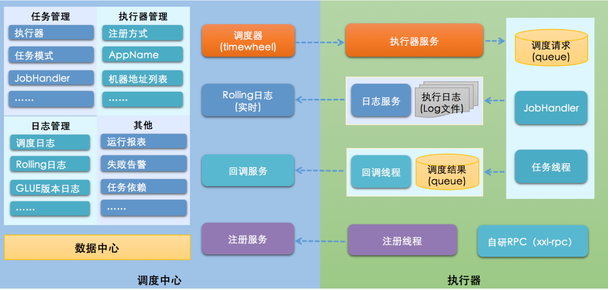
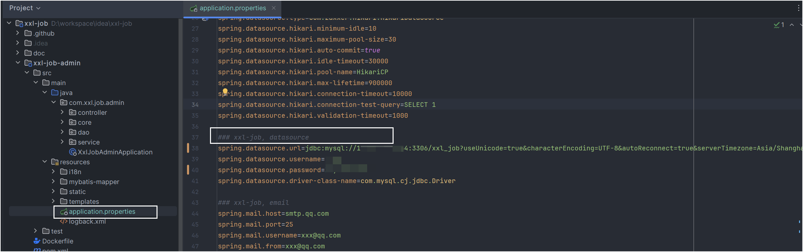
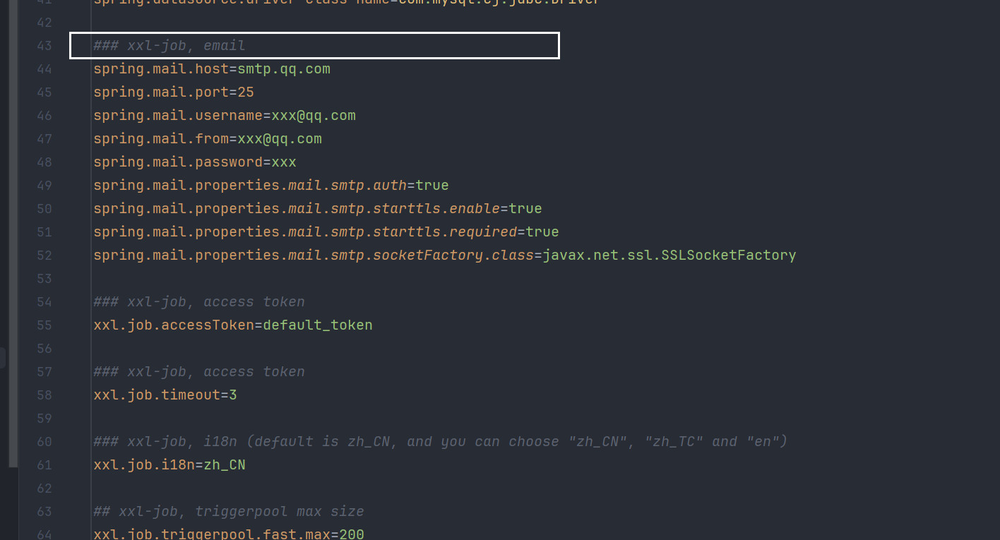
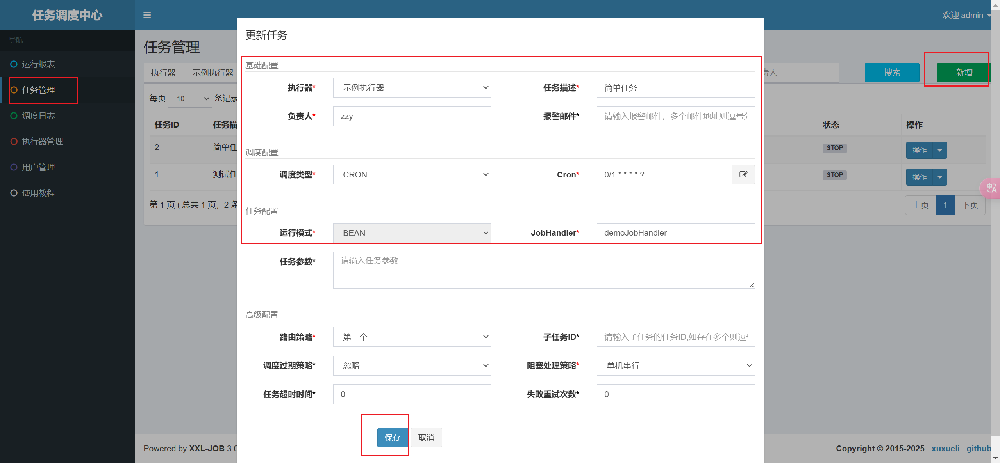

# XXL-JOB

## 什么是任务调度？
我们可以思考一下下面业务场景的解决方案:

- 某电商平台需要每天上午10点，下午3点，晚上8点发放一批优惠券
- 某银行系统需要在信用卡到期还款日的前三天进行短信提醒
- 某财务系统需要在每天凌晨0:10分结算前一天的财务数据，统计汇总

以上场景就是任务调度所需要解决的问题

**任务调度是为了自动完成特定任务，在约定的特定时刻去执行任务的过程**


## 为什么需要分布式调度？
使用Spring中提供的注解@Scheduled，也能实现调度的功能

在业务类中方法中贴上这个注解,然后在启动类上贴上`@EnableScheduling`注解
```java
@Scheduled(cron = "0/20 * * * * ? ")
 public void doWork(){
 	//doSomething   
 }
```

感觉Spring给我们提供的这个注解可以完成任务调度的功能，好像已经完美解决问题了，为什么还需要分布式呢?

主要有如下这几点原因:

1. 高可用：单机版的定式任务调度只能在一台机器上运行，如果程序或者系统出现异常就会导致功能不可用。
2. 防止重复执行: 在单机模式下，定时任务是没什么问题的。但当我们部署了多台服务，同时又每台服务又有定时任务时，若不进行合理的控制在同一时间，只有一个定时任务启动执行，这时，定时执行的结果就可能存在混乱和错误了
3. 单机处理极限：原本1分钟内需要处理1万个订单，但是现在需要1分钟内处理10万个订单；原来一个统计需要1小时，现在业务方需要10分钟就统计出来。你也许会说，你也可以多线程、单机多进程处理。的确，多线程并行处理可以提高单位时间的处理效率，但是单机能力毕竟有限（主要是CPU、内存和磁盘），始终会有单机处理不过来的情况。

## XXL-JOB介绍

XXL-Job：是大众点评的分布式任务调度平台，是一个轻量级分布式任务调度平台, 其核心设计目标是开发迅速、学习简单、轻量级、易扩展

大众点评目前已接入XXL-JOB，该系统在内部已调度约100万次，表现优异。

目前已有多家公司接入xxl-job，包括比较知名的大众点评，京东，优信二手车，360金融 (360)，联想集团 (联想)，易信 (网易)等等

官网地址 https://www.xuxueli.com/xxl-job/

**系统架构图**


**设计思想**

将调度行为抽象形成**调度中心**公共平台，而平台自身并不承担业务逻辑，“调度中心”负责发起调度请求。

将任务抽象成分散的JobHandler，交由“执行器”统一管理，“执行器”负责接收调度请求并执行对应的JobHandler中业务逻辑。

因此，“调度”和“任务”两部分可以相互解耦，提高系统整体稳定性和扩展性；

## 调度中心部署
**源码下载地址:**

[github地址](https://github.com/xuxueli/xxl-job)

[gitee地址](https://gitee.com/xuxueli0323/xxl-job)

执行该路径下的sql文件：<span class="marker-evy">xxl-job\doc\db\tables_xxl_job.sql</span>

需要修改该配置文件下的数据源


这里可以配置，如果任务执行失败，会给予通知


执行该启动文件`XxlJobAdminApplication`

调度中心访问地址: http://localhost:8080/xxl-job-admin

默认登录账号 “admin/123456”

## 执行器部署

新建一个项目，配置**resources/application.properties**文件

```properties
### 调度中心部署根地址 [选填]：如调度中心集群部署存在多个地址则用逗号分隔。执行器将会使用该地址进行"执行器心跳注册"和"任务结果回调"；为空则关闭自动注册；
xxl.job.admin.addresses=http://127.0.0.1:8080/xxl-job-admin
### 执行器通讯TOKEN [选填]：非空时启用；
xxl.job.accessToken=default_token
### 执行器AppName [选填]：执行器心跳注册分组依据；为空则关闭自动注册
xxl.job.executor.appname=xxl-job-executor-sample
### 执行器注册 [选填]：优先使用该配置作为注册地址，为空时使用内嵌服务 ”IP:PORT“ 作为注册地址。从而更灵活的支持容器类型执行器动态IP和动态映射端口问题。
xxl.job.executor.address=
### 执行器IP [选填]：默认为空表示自动获取IP，多网卡时可手动设置指定IP，该IP不会绑定Host仅作为通讯实用；地址信息用于 "执行器注册" 和 "调度中心请求并触发任务"；
xxl.job.executor.ip=127.0.0.1
### 执行器端口号 [选填]：小于等于0则自动获取；默认端口为9999，单机部署多个执行器时，注意要配置不同执行器端口；
xxl.job.executor.port=9999
### 执行器运行日志文件存储磁盘路径 [选填] ：需要对该路径拥有读写权限；为空则使用默认路径；
xxl.job.executor.logpath=/data/applogs/xxl-job/jobhandler
### 执行器日志文件保存天数 [选填] ： 过期日志自动清理, 限制值大于等于3时生效; 否则, 如-1, 关闭自动清理功能；
xxl.job.executor.logretentiondays=30
```


:::warning
xxl.job.accessToken=default_token 调度中心与执行器中的token必须一致
:::

### 添加执行器配置
```java [XxlJobConfig.java]
@Configuration
public class XxlJobConfig {
    @Value("${xxl.job.admin.addresses}")
    private String adminAddresses;
    @Value("${xxl.job.accessToken}")
    private String accessToken;
    @Value("${xxl.job.executor.appname}")
    private String appname;
    @Value("${xxl.job.executor.address}")
    private String address;
    @Value("${xxl.job.executor.ip}")
    private String ip;
    @Value("${xxl.job.executor.port}")
    private int port;
    @Value("${xxl.job.executor.logpath}")
    private String logPath;
    @Value("${xxl.job.executor.logretentiondays}")
    private int logRetentionDays;

    @Bean
    public XxlJobSpringExecutor xxlJobExecutor() {
        XxlJobSpringExecutor xxlJobSpringExecutor = new XxlJobSpringExecutor();
        xxlJobSpringExecutor.setAdminAddresses(adminAddresses);
        xxlJobSpringExecutor.setAppname(appname);
        xxlJobSpringExecutor.setAddress(address);
        xxlJobSpringExecutor.setIp(ip);
        xxlJobSpringExecutor.setPort(port);
        xxlJobSpringExecutor.setAccessToken(accessToken);
        xxlJobSpringExecutor.setLogPath(logPath);
        xxlJobSpringExecutor.setLogRetentionDays(logRetentionDays);
        return xxlJobSpringExecutor;
    }
}
```

添加一个简单的任务处理
```java [SimpleXxlJob.java]
@Component
public class SimpleXxlJob {
    @XxlJob("demoJobHandler")
    public void demoJobHandler() throws Exception {
        System.out.println("执行定时任务,执行时间:" + new Date());
    }
}

```

执行程序后，简单配置一个demo
